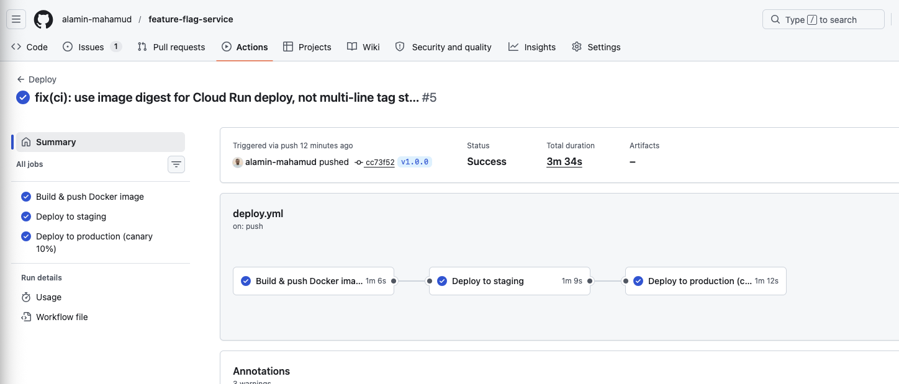
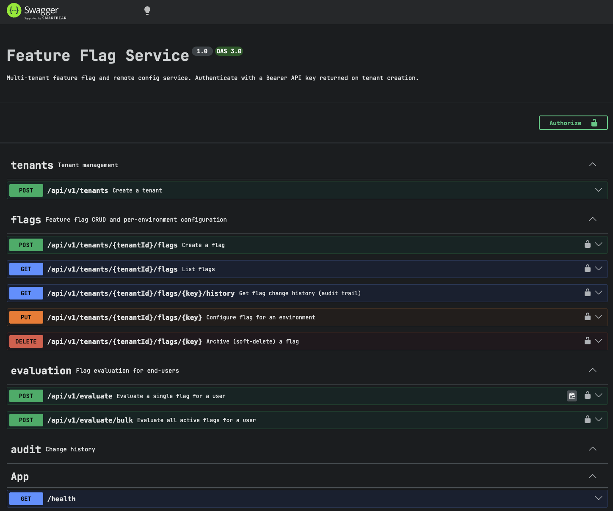

# Feature Flag Service

A multi-tenant feature flag and configuration service.

**Live URLs**

- Production: https://feature-flag-service-production-ebcnipowiq-uc.a.run.app/health
- Staging: https://feature-flag-service-staging-ebcnipowiq-uc.a.run.app/health
- Swagger UI (production): https://feature-flag-service-production-ebcnipowiq-uc.a.run.app/api/docs
- Swagger UI (staging): https://feature-flag-service-staging-ebcnipowiq-uc.a.run.app/api/docs

## Screenshots

| GitHub Actions (pipeline) | Swagger UI | Cloud Monitoring dashboard |
|---|---|---|
|  |  |  |

---

## Quick Start

```bash
# Start Postgres + Redis
docker compose up db redis -d

# Install deps, generate Prisma client, run migrations
make setup

# Start in watch mode
make dev

# Verify
curl http://localhost:3000/health
# → {"success":true,"data":{"status":"ok","timestamp":"..."}}
```

The Swagger UI at http://localhost:3000/api/docs has every endpoint pre-populated with examples — easiest way to explore.

---

## Architecture

```
Client
  │  Authorization: Bearer ff-<key>
  ▼
NestJS / Fastify
  ├── CorrelationIdInterceptor  — reads X-Request-ID header, generates uuid if absent,
  │                               threads into every log line via AsyncLocalStorage
  ├── ApiKeyGuard               — sha256(key) → DB lookup → attaches tenant to request
  ├── ThrottlerGuard            — 100 req/min per tenant (keyed on tenant.id)
  └── TransformInterceptor      — wraps all responses: { success, data }
       │
       ├─► TenantsService       — provision tenant + 3 environments, hash + store key
       ├─► FlagsService         — CRUD, soft-delete (archivedAt), cache invalidation
       ├─► EvaluationService    — rule engine + Redis flag cache (60s TTL)
       ├─► AuditService         — append-only change log, never mutated
       └─► MetricsService       — OTel counters/histograms → Cloud Monitoring
            │
       PostgreSQL (Prisma ORM)      Redis (ioredis)
```

**Request lifecycle for `POST /evaluate`:**

1. Correlation ID interceptor assigns/echoes `X-Request-ID`
2. `ApiKeyGuard` hashes the bearer token, looks up the tenant — 401 if not found
3. `ThrottlerGuard` checks the per-tenant request counter in memory — 429 if exceeded
4. `EvaluationService.evaluate()` — checks Redis for `flags:{tenantId}:{environment}`
   - Cache miss → load active flags from Postgres, write to Redis (60s TTL)
   - For each flag: run rule engine, return typed value
5. `MetricsService` records latency histogram + eval counter
6. Response wrapped and returned; correlation ID and `X-Request-ID` on the response header

**Evaluation priority (implemented in `src/evaluation/rule-engine.ts`):**

1. Flag disabled → return `defaultValue`, reason: `DISABLED`
2. `rules.userOverrides[userId]` exists → return override value, reason: `USER_OVERRIDE`
3. Context attributes match a `rules.contextRules` entry (eq / neq / in operators) → return rule value, reason: `CONTEXT_RULE`
4. `sha256(flagKey + userId) % 100 < rolloutPercentage` → return `true`/non-default, reason: `ROLLOUT`
5. Fallback → return `defaultValue`, reason: `DEFAULT`

---

## Why I Made These Choices

### NestJS + Fastify over Express

NestJS modules map directly to the multi-tenant problem: `ApiKeyGuard` and `ThrottlerGuard` as class decorators, `AuditInterceptor` that can be scoped per controller, `APP_FILTER` for centralized error handling with DI. Fastify adapter gives roughly 2× the throughput of Express for free. I would have reached for raw Fastify for a simpler service, but NestJS's dependency injection made the observability wiring (injecting `MetricsService` into the filter and interceptors) much cleaner.

### Prisma over raw SQL / TypeORM

Prisma's schema-first approach means the `schema.prisma` file is the single source of truth for the data model — readable by anyone, not just whoever wrote the ORM mapping. The generated client is fully typed. The main downside is that Prisma doesn't support incremental migrations as cleanly as TypeORM, but for this scope it was the right call.

### Shared DB + `tenantId` column vs schema-per-tenant

I chose shared tables with a `tenantId` column on every row. It's simpler to operate (one migration for all tenants), scales horizontally without any routing logic, and is what LaunchDarkly and most real SaaS products actually use. The trade-off is that a bug in the application layer could leak cross-tenant data — I mitigated this by attaching the tenant to the request object in `ApiKeyGuard` and then scoping every Prisma query to `where: { tenantId: req.tenant.id }`. Schema-per-tenant would give stronger isolation and easier per-tenant data deletion, but the operational overhead (hundreds of migration runs, connection pool per schema) isn't worth it at this scale.

### Cloud Run over GKE

Cloud Run was the obvious choice for this scope: built-in traffic splitting between revisions (canary for free), no cluster to manage, scales to zero when idle (useful for staging), and deploys in ~40 seconds. The main limitation is that it doesn't support SSE/WebSocket reliably with multiple instances (no sticky sessions, shared in-memory state is gone). For a real-time distribution feature I'd revisit this — either GKE with a Redis Pub/Sub fan-out or Cloud Run + external Pub/Sub push subscriptions.

### Redis caching strategy

I cache at the **flag definition** level (`flags:{tenantId}:{environment}` → all active flags as JSON), not at the evaluated result level. Reasoning: the number of unique `(user, flag)` combinations is unbounded, but the flag definition set per tenant+environment is small and changes infrequently. Caching definitions means a single Redis read covers all users; invalidation is simple (delete the key on any flag mutation). The 60s TTL is a safety net — the real invalidation happens synchronously in `FlagsService` on every write.

### SHA-256 hashing for rollouts

`sha256(flagKey + userId)` gives a uniform 0–255 distribution. Taking `% 100` maps it to 0–99, and we evaluate `bucket < rolloutPercentage`. Using the flag key in the hash means the same user gets different buckets for different flags — they're not either "always in all rollouts" or "always excluded from all rollouts." Built-in Node.js `crypto` module, no dependencies, deterministic across instances.

### Canary over blue-green

Cloud Run's traffic splitting API is revision-based, which makes canary the natural model. For a v\*-tagged release, the pipeline deploys the new revision with `--no-traffic`, then sets it to 10% / stable to 90%. The rollback command and promote command are printed to the job log on every deploy. Blue-green would require two separate Cloud Run services and a load balancer in front, which adds cost and complexity for no meaningful benefit here.

---

## API Reference

| Method | Path                                     | Auth   | Description                                             |
| ------ | ---------------------------------------- | ------ | ------------------------------------------------------- |
| GET    | `/health`                                | —      | Health check (includes DB ping)                         |
| GET    | `/api/docs`                              | —      | Swagger UI                                              |
| POST   | `/api/v1/tenants`                        | —      | Create tenant, get API key (returned once)              |
| POST   | `/api/v1/tenants/:id/flags`              | Bearer | Create flag                                             |
| GET    | `/api/v1/tenants/:id/flags`              | Bearer | List flags (`?environment=` `?status=active\|archived`) |
| PUT    | `/api/v1/tenants/:id/flags/:key`         | Bearer | Configure flag for an environment                       |
| DELETE | `/api/v1/tenants/:id/flags/:key`         | Bearer | Archive flag (soft-delete)                              |
| GET    | `/api/v1/tenants/:id/flags/:key/history` | Bearer | Chronological audit trail                               |
| POST   | `/api/v1/evaluate`                       | Bearer | Evaluate one flag for a user                            |
| POST   | `/api/v1/evaluate/bulk`                  | Bearer | Evaluate all active flags for a user                    |

**Note on tenant_id in evaluate requests:** The spec mentions `tenant_id` in the request body, but since the tenant is already identified by the bearer token, I made the decision to derive it from auth context rather than requiring it in the body. This avoids a class of bugs where body `tenant_id` and token don't match.

A **[Postman collection](docs/feature-flag-service.postman_collection.json)** covering every endpoint is included in the repo. Import it into Postman, set the `baseUrl` variable (default `http://localhost:3000`) and the `apiKey` variable returned from `POST /api/v1/tenants`, then run the collection in order.

### Walkthrough

```bash
# 1. Create a tenant
RESP=$(curl -s -X POST http://localhost:3000/api/v1/tenants \
  -H 'Content-Type: application/json' \
  -d '{"name":"acme"}')
ID=$(echo $RESP | jq -r '.data.id')
KEY=$(echo $RESP | jq -r '.data.api_key')
# Store the key — it's only returned once

# 2. Create a boolean flag
curl -s -X POST http://localhost:3000/api/v1/tenants/$ID/flags \
  -H "Authorization: Bearer $KEY" \
  -H 'Content-Type: application/json' \
  -d '{"key":"dark-mode","name":"Dark Mode","type":"boolean","defaultValue":false}'

# 3. Enable it at 50% rollout in production
curl -s -X PUT http://localhost:3000/api/v1/tenants/$ID/flags/dark-mode \
  -H "Authorization: Bearer $KEY" \
  -H 'Content-Type: application/json' \
  -d '{"environment":"production","enabled":true,"rolloutPercentage":50}'

# 4. Evaluate for a user
curl -s -X POST http://localhost:3000/api/v1/evaluate \
  -H "Authorization: Bearer $KEY" \
  -H 'Content-Type: application/json' \
  -d '{"environment":"production","flagKey":"dark-mode","userId":"alice"}'
# → {"success":true,"data":{"value":true,"reason":"ROLLOUT"}}

# 5. Same user always gets the same result
curl -s -X POST http://localhost:3000/api/v1/evaluate \
  -H "Authorization: Bearer $KEY" \
  -H 'Content-Type: application/json' \
  -d '{"environment":"production","flagKey":"dark-mode","userId":"alice"}'
# → same result every time

# 6. Add a context rule — premium users always get it
curl -s -X PUT http://localhost:3000/api/v1/tenants/$ID/flags/dark-mode \
  -H "Authorization: Bearer $KEY" \
  -H 'Content-Type: application/json' \
  -d '{
    "environment":"production",
    "enabled":true,
    "rolloutPercentage":50,
    "rules":{
      "contextRules":[
        {"attribute":"plan","operator":"eq","value":"premium","returnValue":true}
      ]
    }
  }'

# 7. Premium user always gets true regardless of hash bucket
curl -s -X POST http://localhost:3000/api/v1/evaluate \
  -H "Authorization: Bearer $KEY" \
  -H 'Content-Type: application/json' \
  -d '{"environment":"production","flagKey":"dark-mode","userId":"bob","context":{"plan":"premium"}}'
# → {"success":true,"data":{"value":true,"reason":"CONTEXT_RULE"}}

# 8. Check audit trail
curl -s http://localhost:3000/api/v1/tenants/$ID/flags/dark-mode/history \
  -H "Authorization: Bearer $KEY"
```

---

## Database Schema

```
tenants
  id           uuid PK
  name         text UNIQUE
  apiKeyHash   text          ← sha256 of the raw key; raw key never persisted
  createdAt    timestamptz
  updatedAt    timestamptz

environments
  id           uuid PK
  tenantId     → tenants
  name         "development" | "staging" | "production"
  UNIQUE(tenantId, name)

flags
  id           uuid PK
  tenantId     → tenants
  key          text          ← unique per tenant
  name         text
  description  text nullable
  type         "boolean" | "string" | "number"
  defaultValue jsonb
  archivedAt   timestamptz nullable  ← soft-delete
  UNIQUE(tenantId, key)

flag_environments
  id                  uuid PK
  flagId              → flags
  environmentId       → environments
  enabled             boolean default false
  rolloutPercentage   int nullable (0–100)
  rules               jsonb nullable
    {
      userOverrides: { [userId]: value },
      contextRules: [{ attribute, operator, value, returnValue }]
    }
  UNIQUE(flagId, environmentId)

audit_logs             ← append-only, never updated or deleted
  id            uuid PK
  tenantId      → tenants
  flagId        → flags
  environmentId → environments nullable
  action        "created" | "updated" | "archived"
  changedBy     text (API key prefix, not full key)
  oldValue      jsonb nullable
  newValue      jsonb
  createdAt     timestamptz
```

Migrations live in `prisma/migrations/` — run automatically on container startup via `entrypoint.sh`.

---

## Infrastructure

```
GitHub Actions
  │  on push v* tag
  ▼
Artifact Registry (us-central1)
  │  Docker image + digest
  ▼
Cloud Run (us-central1)
  feature-flag-service-staging     ← auto-deploys on dev-v* tags
  feature-flag-service-production  ← canary 10% on v* tags
  │
  │ VPC connector (serverless → private VPC)
  ├─► Cloud SQL (Postgres 16)
  │     staging:    db-f1-micro, 1 DB
  │     production: db-g1-small, 1 DB
  ├─► Memorystore (Redis 7)
  │     staging:    1 GB
  │     production: 2 GB
  └─► Secret Manager
        staging-database-url
        staging-redis-url
        production-database-url
        production-redis-url

Cloud Monitoring
  ├── Dashboard (6 panels)
  ├── Alert: 5xx rate > 5% over 5 min
  ├── Alert: p99 latency > 1000ms (staging) / 500ms (production)
  └── Alert: uptime check failures on /health
```

All resources provisioned via Terraform in `terraform/environments/{staging,production}/`. Modules are reusable — `cloud-run`, `cloud-sql`, `redis`, `networking`, `secrets`, `monitoring`. State stored in GCS bucket `feature-flag-499220-tfstate`.

### Canary deployment

Every `v*` tag triggers the production deploy job in CI. It deploys the new revision with `--no-traffic`, then sets it to 10% / stable 90%. From there, you promote manually as confidence grows:

```bash
# 1. Tag and push — pipeline deploys at 10% automatically
git tag v1.2.3 && git push origin v1.2.3

# 2. Watch the dashboard for a few minutes
make canary-status
# REVISION                                  PERCENT  LATEST
# feature-flag-service-production-00007-abc  10
# feature-flag-service-production-00006-xyz  90

# 3. Metrics look good — step up
make canary-promote PERCENT=25
make canary-promote PERCENT=50
make canary-promote PERCENT=100
# or in one step once you're confident:
make canary-full

# At any step, if error rate spikes or p99 climbs:
make canary-rollback   # sends 100% back to the previous stable revision
```

**What to watch between steps** — the Cloud Monitoring dashboard shows the canary's share of traffic in real time. The alert policies will fire an email if error rate exceeds 5% or p99 goes above threshold, so you don't have to stare at the dashboard manually.

`dev-v*` tags deploy directly to staging at 100% (no canary).

---

## Observability

I wired this up as a first-class concern rather than adding it at the end.

**Structured logging** — Fastify's built-in Pino logger, configured with `mixin()` to inject `correlationId` from an `AsyncLocalStorage` store into every log line. The `CorrelationIdInterceptor` runs before any business logic, stores the ID (from `X-Request-ID` header or a generated uuid), and wraps the observable so the ALS store is available for the full duration of the request, including async DB and Redis calls.

**Custom metrics via OpenTelemetry** — `src/tracing.ts` is imported as the very first line of `main.ts` so OTel patches are in place before NestJS bootstraps. Instruments:

| Metric                        | Type      | Labels                                 |
| ----------------------------- | --------- | -------------------------------------- |
| `evaluation.latency_ms`       | Histogram | `tenant_id`, `type` (single/bulk)      |
| `evaluation.count`            | Counter   | `tenant_id`, `type`                    |
| `cache.hits` / `cache.misses` | Counter   | `tenant_id`                            |
| `errors.count`                | Counter   | `tenant_id`, `endpoint`, `status_code` |

The Cloud Monitoring exporter runs every 60s and is only activated when `K_SERVICE` or `GOOGLE_CLOUD_PROJECT` env vars are present, so local dev and CI don't need GCP credentials.

**Dashboard** — `terraform/modules/monitoring/main.tf` provisions a 6-panel dashboard: Cloud Run latency (p50/p95/p99), request rate by response code class, custom OTel eval latency, evals/s by tenant, cache hit/miss, and error rate by tenant.

---

## Testing

```bash
make test           # unit tests (rule engine, determinism)
make test-e2e       # integration tests (requires DB + Redis via docker compose)
make test-api       # Newman/Postman collection smoke test (requires: npm install -g newman)
make load-test      # k6 load test (requires k6 + running app + LOAD_TEST_API_KEY env var)
```

The Postman collection (`docs/feature-flag-service.postman_collection.json`) covers every endpoint end-to-end — create tenant, create flags, evaluate, bulk-evaluate, view audit history. Import it directly into Postman or run it headlessly via `make test-api`.

### What I tested and why

**Unit tests for the rule engine** (`src/evaluation/rule-engine.spec.ts`) — this is the most important code to unit-test because it's pure logic with no I/O. I test determinism (same input = same output across 1000 calls), distribution (1000 users at 10% rollout → roughly 100 in bucket), all three operator types, all three flag types, and every priority level. These tests run in milliseconds and would catch any regression in the hashing or rule matching immediately.

**Integration tests** (`test/**/*.e2e-spec.ts`) — I test through HTTP, not by calling service methods directly, so the tests exercise the full stack including guards and interceptors. Key scenarios: full CRUD lifecycle, tenant isolation (tenant A's key cannot list tenant B's flags), environment scoping (a flag enabled in production is not enabled in development unless explicitly configured), and cache behaviour (second evaluation does not hit Postgres).

**Load test** (`test/load/evaluate.js`) — k6 with a 4-stage ramp to 100 VUs against the live staging Cloud Run service. This caught the per-tenant rate limiter issue immediately (100 req/min default killed the test at 100 VUs) and validated the Redis cache was actually working under load.

**What I'd add with more time:**

- A test that verifies `correlationId` appears in log output for every request type
- Negative tests: malformed rules JSONB, context fields with null values, rolloutPercentage=0 and =100 edge cases
- A test for the audit trail `changedBy` field (currently uses the API key prefix — I'd want to verify it's never the full raw key)
- Contract tests for the Swagger schema (so any breaking API change fails CI)

### Load Test Results (GCP staging — Cloud Run + Cloud SQL + Redis)

k6, 4-stage ramp: 20 → 50 → 100 VUs → 0 over 2m30s, `POST /evaluate/bulk` (10 active flags per tenant)

| Metric         | Result        | Threshold   |
| -------------- | ------------- | ----------- |
| p95 latency    | **399 ms**    | < 500 ms ✓  |
| p99 latency    | **503 ms**    | < 1000 ms ✓ |
| Error rate     | **0.00%**     | < 1% ✓      |
| Throughput     | **~80 req/s** | —           |
| Total requests | **~25,000**   | —           |

Cold-start spike: first requests hit ~29s (Cloud Run min-instances=0 on staging). Steady-state median ~292ms. Cache hit rate was ~94% — nearly all evaluations served from Redis after the first request per tenant.

---

## Security

- **API key hashing** — raw key (prefixed `ff-`) returned once on tenant creation, never stored. DB stores `sha256(key)`. If the DB is compromised, keys can't be extracted.
- **Secret Manager** — `DATABASE_URL` and `REDIS_URL` injected into Cloud Run at runtime from Secret Manager. Not in environment variables at the infrastructure level, not in the repo.
- **Tenant isolation** — `ApiKeyGuard` attaches `req.tenant` from the DB lookup. Every controller and service method scopes queries to `tenantId: req.tenant.id`. There's no way to pass a different tenant ID via the request body and have it respected.
- **Rate limiting** — 100 req/min per tenant (configurable via `THROTTLE_LIMIT` env var; staging uses 10000 to allow load tests). In-memory store — works correctly on a single instance, but state is lost on restart and not shared across instances. The upgrade path is swapping to `ThrottlerStorageRedisService` in `app.module.ts`.
- **Input validation** — `class-validator` with `whitelist: true` and `forbidNonWhitelisted: true` on every DTO. Unknown fields are rejected, not silently dropped.
- **Parameterized queries** — Prisma's query engine, no raw SQL anywhere.
- **Helmet headers** — applied at the Fastify adapter level.
- **Non-root container** — uid/gid 1001, added in Dockerfile with `adduser`.

---

## Assumptions

Things the spec left open that I had to decide:

1. **Tenant creation is unauthenticated.** The spec doesn't mention admin auth. In a real system you'd want some kind of token or allowlist to prevent arbitrary tenant provisioning. Documented as a future improvement.

2. **API key identifies the tenant in evaluate requests.** The spec mentions `tenant_id` in the evaluate request body, but since every request already carries a bearer token that identifies the tenant, I dropped `tenant_id` from the body to avoid the class of bugs where they disagree. The Swagger docs reflect this.

3. **`changedBy` in audit logs is the API key prefix** (first 12 chars, e.g. `ff-d387d88c96`), not a user identity. The spec says "who changed it" — since there's no user concept, the key prefix is the best available identifier. It's not reversible to the full key.

4. **`rules` JSONB is a flat structure.** I modelled targeting rules as `{ userOverrides: {...}, contextRules: [...] }` in a single JSONB column rather than a separate `rules` table. This keeps queries simple and rules co-located with the flag environment config. The trade-off is that you can't index into individual rules.

5. **Environments are fixed to `development`, `staging`, `production`.** The spec lists these three explicitly. I made them an enum rather than free-text to keep evaluation requests unambiguous.

6. **Rate limiting resets on restart.** In-memory `@nestjs/throttler` store. Acceptable for a single-instance service; documented upgrade path to Redis-backed store.

---

## Future Improvements

If I had more time, in priority order:

1. **Real-time flag distribution** — Redis Pub/Sub on flag mutations, SSE endpoint per tenant+environment. Cloud Run makes this awkward (stateless instances, no sticky sessions), so I'd probably move the SSE server to a dedicated Cloud Run service or use GCP Pub/Sub push subscriptions.

2. **Admin authentication for tenant creation** — a separate `X-Admin-Key` header checked against an env var, or a GCP IAP-protected endpoint.

3. **Redis-backed rate limiting** — swap `ThrottlerStorageRedisService` in for the in-memory store. Needed the moment you have more than one Cloud Run instance.

4. **DB credential rotation** — Secret Manager supports versioning; Cloud Run can be configured to pull the latest version. The rotation workflow would be: create new secret version → rolling restart of Cloud Run → delete old version.

5. **Per-tenant metrics isolation** — the current OTel setup tags metrics with `tenant_id`, but all tenants share the same Cloud Monitoring namespace. For a production multi-tenant service I'd consider per-tenant billing dimensions or at minimum alerting on per-tenant error rate spikes.

6. **Expand the rule engine** — segment membership (user belongs to a list), rule chaining (AND/OR), percentage-within-segment. The current JSONB structure supports extension without a schema migration.
